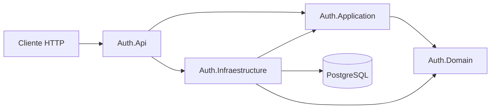
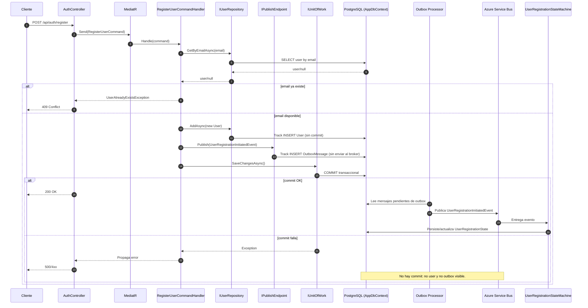
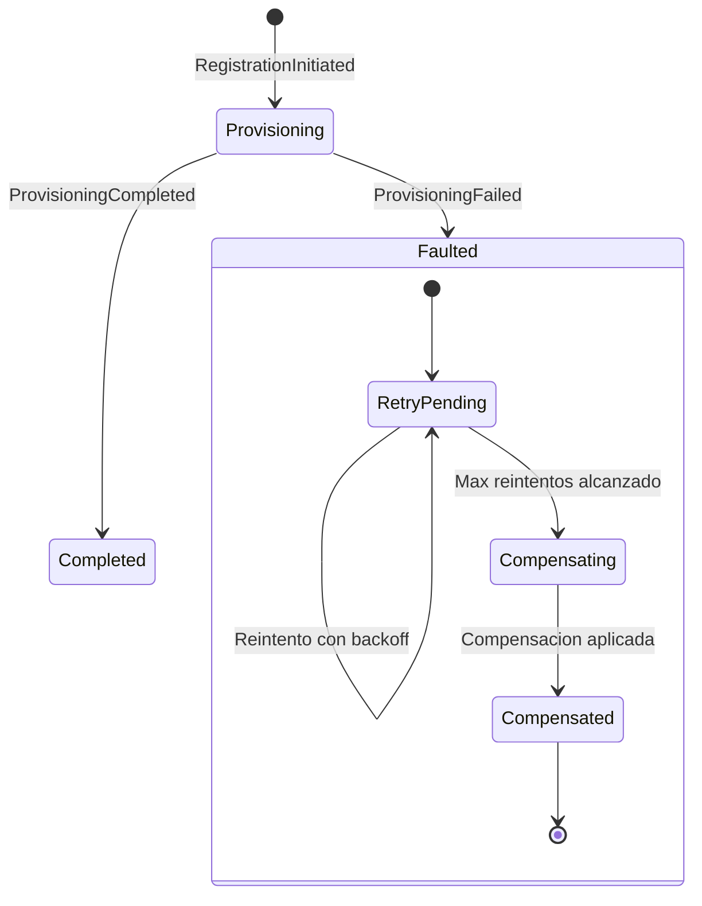

# Contexto Reducido - Arca.Auth

## 1) Resumen rapido
- Solucion .NET 10 con 4 proyectos en arquitectura por capas (API, Application, Domain, Infraestructure).
- Dominio principal: autenticacion y gestion basica de usuarios (registro, login, cambio de password).
- Patron principal: CQRS ligero con MediatR (comandos y handlers).
- Persistencia: Entity Framework Core + PostgreSQL (Npgsql).
- Seguridad: JWT Bearer + hash de password con BCrypt.
- Integracion asincrona: MassTransit + Azure Service Bus + Saga State Machine.
- Consistencia de mensajes: Entity Framework Outbox (UseBusOutbox).

## 2) Composicion de la solucion

### Proyectos
- Auth.Api: capa de entrada HTTP (controllers, middleware, configuracion de auth/swagger).
- Auth.Application: casos de uso (commands + handlers), contratos de servicios, validaciones.
- Auth.Domain: entidades, value objects, excepciones de dominio, contratos de repositorio.
- Auth.Infraestructure: implementaciones tecnicas (EF Core, repositorios, token, password hasher, DI).

### Referencias entre proyectos
- Auth.Api -> Auth.Application
- Auth.Api -> Auth.Infraestructure
- Auth.Application -> Auth.Domain
- Auth.Infraestructure -> Auth.Application
- Auth.Infraestructure -> Auth.Domain

## 3) Arquitectura (vista de capas)

## 4) Ficheros clave por capa

### Auth.Api
- Program.cs
  - Registra controllers, Application + Infraestructure, Swagger, JWT.
  - Pipeline: ExceptionHandlingMiddleware, Swagger, HTTPS redirection, Authorization, MapControllers.
- ServiceExtensions.cs
  - AddSwaggerDocumentation()
  - AddJwtAuthentication() con TokenValidationParameters (Issuer, Audience, Key, Lifetime).
- Controllers/AuthController.cs
  - Endpoints:
    - POST /api/auth/register
    - POST /api/auth/login
    - POST /api/auth/change-password (Authorize)
  - Invoca IMediator para enviar comandos.
- Middlewares/ExceptionHandlingMiddleware.cs
  - Manejo global de excepciones -> respuesta JSON uniforme.
  - Mapea ValidationException, UserAlreadyExistsException, InvalidCredentialsException.

### Auth.Application
- DependencyInjection.cs
  - Registra MediatR, FluentValidation y ValidationBehavior en pipeline.
- Common/Behaviours/ValidationBehavior.cs
  - Ejecuta validadores antes de handler y lanza ValidationException.
- Validators/FluentValidation.cs
  - Validator de RegisterUserCommand (email valido, password minima).
- Features/Users/Commands/RegisterUserCommand.cs
  - DTO/Command para registro.
- Features/Users/Commands/RegisterUserCommandHandler.cs
  - Verifica email unico, crea User, publica evento de integracion y ejecuta commit con IUnitOfWork.
- Features/Users/Commands/LoginUserCommand.cs
  - DTO/Command para login.
- Features/Users/Commands/LoginUserCommandHandler.cs
  - Verifica credenciales y genera JWT.
- Features/Users/Commands/ChangePasswordCommand.cs
  - DTO/Command para cambio de password.
- Features/Users/Commands/ChangePasswordCommandHandler.cs
  - Valida password actual, valida nueva password, actualiza hash.
- Interfaces/Security/IPasswordHasher.cs
  - Contrato Hash/Verify.
- Interfaces/Common/ITokenService.cs
  - Contrato GenerateToken().
- Interfaces/Common/IUnitOfWork.cs
  - Contrato SaveChangesAsync() para commit explicito del caso de uso.

### Auth.Domain
- Entities/User.cs
  - Entidad usuario (Id, Email, PasswordHash, RoleId, IsActive) y UpdatePassword().
- Entities/Role.cs
- Entities/Permission.cs
- Entities/RolePermission.cs
- ValueObjects/Email.cs
  - Validacion basica de formato (contiene @).
- ValueObjects/Password.cs
  - Reglas minimas: >= 8, al menos un digito.
- Exceptions/DomainException.cs
- Exceptions/InvalidCredentialsException.cs
- Exceptions/UserAlreadyExistsException.cs
- Interfaces/Repositories/*.cs
  - Contratos de acceso a datos (User, Role, Permission, RolePermission).

### Auth.Infraestructure
- DependencyInjection.cs
  - Registra AppDbContext (Npgsql), repositorios, TokenService, PasswordHasher, MassTransit, Saga y EF Outbox.
- Persistence/AppDbContext.cs
  - DbSet de User/Role/Permission/UserRegistrationState.
  - Aplica configuraciones por assembly y tablas de outbox/inbox de MassTransit.
- Persistence/Sagas/UserRegistrationState.cs
  - Estado persistido de la saga de registro (CorrelationId, CurrentState, Email, CreatedAt).
- Sagas/UserRegistrationStateMachine.cs
  - Orquesta el flujo de registro/provisioning con eventos de integracion.
- Persistence/Configurations/UserRegistrationStateConfiguration.cs
  - Configura PK explicita en CorrelationId y mapeo de tabla user_registration_states.
- Persistence/Repositories/UserRepository.cs
  - GetById, GetByEmail, Add, Update sin SaveChanges interno (preparado para UoW).
- Persistence/Repositories/RoleRepository.cs
- Persistence/Repositories/PermissionRepository.cs
- Persistence/Repositories/RolePermissionRepository.cs
- Services/TokenService.cs
  - Construye JWT con claims NameId, Email, Jti; expiracion 2 horas.
- Services/PasswordHasher.cs
  - BCrypt hash/verify.
- Security/BCryptPasswordHasher.cs
  - Implementacion alternativa de IPasswordHasher (no registrada en DI actual).
- Migrations/20260715203007_InitialCreate.*
  - Migracion inicial de schema.

## 5) Flujo funcional resumido

### Registro
1. API recibe RegisterUserCommand.
2. MediatR ejecuta ValidationBehavior.
3. Handler valida unicidad de email via IUserRepository.
4. Hashea password y agrega User al DbContext.
5. Handler publica UserRegistrationInitiatedEvent por IPublishEndpoint.
6. Handler ejecuta IUnitOfWork.SaveChangesAsync para confirmar en una sola unidad de trabajo (DB + outbox).

### Login
1. API recibe LoginUserCommand.
2. Handler busca usuario por email.
3. Verifica password con IPasswordHasher.
4. Genera JWT con ITokenService.
5. API responde token.

### Cambio de password
1. Endpoint protegido (Authorize) obtiene userId desde claims.
2. Handler valida password actual.
3. Valida nueva password (ValueObject Password).
4. Actualiza hash y persiste.

## 5.1) Diagrama grafico de Register + Outbox + Saga

### Secuencia tecnica (lo que ocurre en runtime)

### Estados de la saga y compensaciones sugeridas

Metodos compensatorios tipicos tras fallo en provisioning:
1. Marcar usuario como inactivo/pending manual review (soft compensation).
2. Eliminar usuario creado si la regla de negocio exige all-or-nothing (hard compensation).
3. Publicar evento UserRegistrationFailed para notificaciones y auditoria.
4. Crear tarea de reproceso (dead-letter/retry queue) con correlacion por CorrelationId.
5. Registrar motivo tecnico/funcional de fallo en el estado de saga para soporte.

## 6) Configuracion y dependencias relevantes
- Framework objetivo: net10.0 en todos los proyectos.
- Paquetes clave:
  - MediatR
  - FluentValidation
  - MassTransit.Azure.ServiceBus.Core
  - MassTransit.EntityFrameworkCore
  - Microsoft.AspNetCore.Authentication.JwtBearer
  - EntityFrameworkCore + Npgsql
  - BCrypt.Net-Next
  - Swashbuckle.AspNetCore
- Configuracion JWT en appsettings*.json: Jwt:Key, Jwt:Issuer, Jwt:Audience.

## 7) Observaciones para otra IA (importante)
- Existe typo consistente en nombre de proyecto: Infraestructure (no Infrastructure).
- En Program.cs se configura JWT, pero el pipeline usa UseAuthorization() y no incluye UseAuthentication(); revisar si es intencional.
- Hay dos implementaciones de IPasswordHasher en Infraestructure (Services/PasswordHasher y Security/BCryptPasswordHasher); DI registra solo Services/PasswordHasher.
- La validacion de Email es minima (solo contiene @), posible endurecimiento futuro.
- Se registro IUnitOfWork en DI, pero verificar que exista la implementacion concreta UnitOfWork en Infraestructure (si falta, no compila).
- La estrategia SaveChanges aun no esta homogenea: UserRepository ya no persiste internamente, pero otros repositorios todavia ejecutan SaveChangesAsync dentro de sus metodos.
- La saga UserRegistrationState ya esta mapeada con PK explicita (CorrelationId), corrigiendo el error de DbContext design-time.

## 8) Contexto minimo sugerido para prompts
Usa este resumen en otra IA:

"Proyecto .NET 10 de autenticacion con arquitectura en 4 capas: Auth.Api (controllers + middleware), Auth.Application (CQRS con MediatR + validaciones FluentValidation), Auth.Domain (entidades y value objects), Auth.Infraestructure (EF Core PostgreSQL + repos + JWT + BCrypt + MassTransit). Implementa Saga de registro de usuario con estado persistido en EF (UserRegistrationState) y Entity Framework Outbox con UseBusOutbox para atomicidad entre cambios de BD y eventos. En RegisterUserCommandHandler: AddAsync + Publish(UserRegistrationInitiatedEvent) + IUnitOfWork.SaveChangesAsync."
